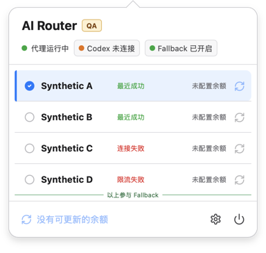
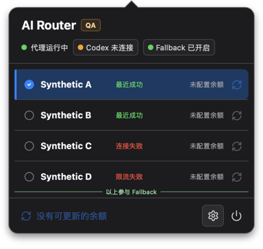
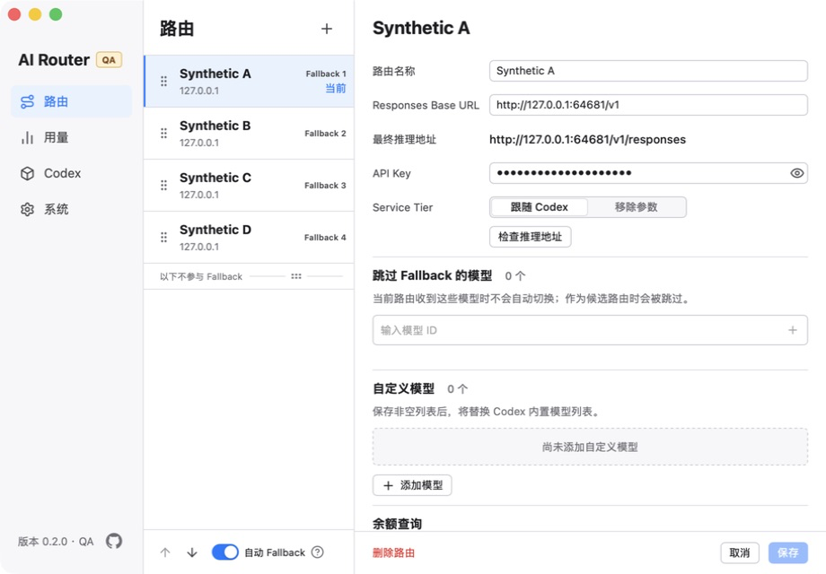
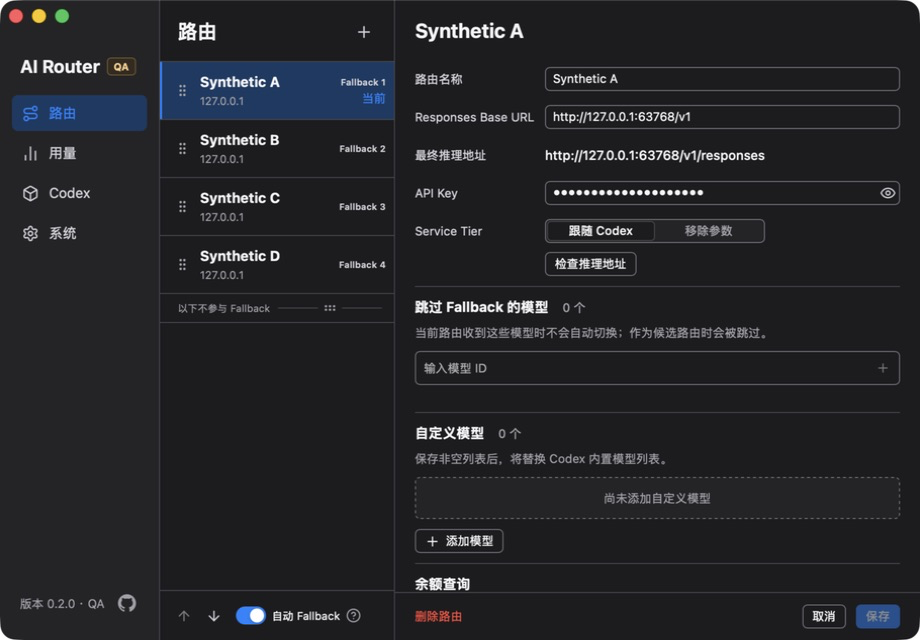

# AI Router

AI Router 是一款面向中文 macOS 个人开发者的本地菜单栏应用，用于在 Codex CLI 或
Codex App 与多个兼容 OpenAI Responses API 的上游之间切换路由。它可以查询余额、自动
回退路由、管理自定义 Codex 模型目录和图片生成 MCP，并在本地汇总请求用量。

项目仍处于早期开发阶段，提供简体中文界面、官方 Apple Silicon DMG 和源码。它不是稳定的
通用网络代理或企业级网关。

[前往 GitHub Releases 下载官方 DMG](https://github.com/Angry3D/ai-router/releases)

## 主要功能

- 在菜单栏查看代理、Codex 和 Fallback 状态，一键切换当前路由。
- 为多个 Responses API 上游保存路由信息、查询余额，并在故障时按顺序回退。
- 通过受保护的配置投影连接 Codex；断开时恢复之前保存的配置目标。
- 管理自定义模型目录和图片生成 MCP，无需手工维护对应的 Codex 配置片段。
- 按路由、模型、状态和时间查看 token、费用估算与延迟等本地请求元数据。
- 备份和恢复本地设置，并保留有界诊断信息。

## 软件截图

截图由隔离的 `AI Router QA.app` 和合成数据生成，不包含真实路由、API Key 或请求内容。
捕获与来源记录见 [README 图片说明](./docs/images/readme/README.md)。

### 菜单与路由切换

| 浅色主题                                                                                                                                      | 深色主题                                                                                                                                     |
| --------------------------------------------------------------------------------------------------------------------------------------------- | -------------------------------------------------------------------------------------------------------------------------------------------- |
|  |  |

### 路由配置

| 浅色主题                                                                                                                                           | 深色主题                                                                                                                                          |
| -------------------------------------------------------------------------------------------------------------------------------------------------- | ------------------------------------------------------------------------------------------------------------------------------------------------- |
|  |  |

## 支持范围

| 项目     | 当前边界                                                                                 |
| -------- | ---------------------------------------------------------------------------------------- |
| 操作系统 | macOS 13 或更高版本                                                                      |
| 硬件     | Apple Silicon (`aarch64`)                                                                |
| Codex    | 需要已安装并可运行的 Codex CLI 或 Codex App；自动兼容性检查固定为 `codex-cli 0.147.0`    |
| 界面语言 | 简体中文                                                                                 |
| 分发     | 官方 DMG 使用 ad-hoc 签名，不做 Developer ID 签名或 Apple 公证；支持显式确认的应用内更新 |
| 网络边界 | 本地代理仅监听 loopback；上游请求按用户配置的 Responses API 地址发出                     |

未列出的 Codex 版本可能可以工作，但当前没有兼容性保证。Windows、Linux 和 Intel Mac 不在
支持范围内。完整边界见 [支持说明](./SUPPORT.md)。

## 安装和首次使用

只从 [GitHub Releases](https://github.com/Angry3D/ai-router/releases) 下载文件名为
`AI.Router_<version>_aarch64.dmg` 的资产。打开 DMG，将 `AI Router.app` 拖入“应用程序”，
再从 Finder 启动。

官方 DMG 使用 macOS ad-hoc 签名以保持 bundle 内代码一致，但不包含 Apple Developer ID 身份，
也没有经过 Apple 公证或 Apple 验证。首次打开如果被 macOS 阻止，请打开“系统设置 -> 隐私与
安全性”，在“安全性”区域确认被阻止的是 `AI Router.app`，选择“仍要打开”，再在系统确认框中
允许。项目不建议使用终端命令关闭或绕过 Gatekeeper。

首次启动后：

1. 打开菜单栏中的 AI Router，在“设置 -> 路由”新增一条路由，填写兼容 Responses API 的
   地址和密钥。
2. 保存并测试路由；确认状态正常后，将它设为当前路由。
3. 在菜单中明确执行 Codex 连接。连接会受保护地更新 Codex 当前 provider 的传输字段；断开
   会恢复已保存的恢复目标。

首次连接前，请阅读 [数据、隐私与恢复](./docs/engineering/data-privacy-recovery.md)，确认你理解
API Key 的保存方式和 Codex 配置所有权边界。

Release 同时提供 updater 归档、`.sig`、`latest.json`、`SHA256SUMS` 和 GitHub provenance。
普通首次安装只需下载 DMG；其他文件用于更新认证、人工校验和构建来源证明。具体校验方式见
[发布与应用更新](./docs/engineering/application-updates.md)。

## 应用内更新

官方安装可在“设置 -> 系统 -> 应用更新”中手动检查。应用启动并正常运行 60 秒后也会静默检查
一次，跨启动最多每 24 小时尝试一次。后台检查不会自动下载、安装、通知或打断代理请求。

发现新稳定版本后，设置页会先显示经发布负责人审核的重点更新。下载和安装需要一次明确确认，
安装完成后的重启需要再次确认；更新包必须先通过项目 updater 签名校验。

第一个包含 updater 的版本需要手动桥接：已有源码构建或更旧版本不能自动升级到它，需先安装
该版本的 DMG。此后的官方版本才能使用应用内更新。

## 数据、隐私和支持

- 路由、API Key、设置、请求元数据和恢复状态保存在应用数据目录的 `router.sqlite3`。
- API Key 不写入普通运行日志，但会以原始字节保存在受私有权限保护的 SQLite 数据库中；当前
  不使用 macOS Keychain，也不做应用层加密。
- 请求记录只保留路由、状态、token、费用估算等有界元数据，不保存原始提示词或完整响应正文。
- 运行日志使用固定错误码和有界计数，不应包含 API Key、Authorization header、请求正文、
  完整配置、上游 URL 或 provider 原始消息。
- 恢复点保存关键配置，包括路由密钥和 Codex 配置恢复信息；不包含请求历史、用量行或日志。
- AI Router 不提供云同步。所有外发流量来自用户配置的上游请求或 Codex 自身行为。

具体路径、备份范围和恢复限制见
[数据、隐私与恢复](./docs/engineering/data-privacy-recovery.md)。安全问题不要提交到公开 Issue，
请按 [安全政策](./SECURITY.md) 使用私下报告入口。

常见问题：

- 官方 DMG 首次启动被阻止：使用“系统设置 -> 隐私与安全性 -> 仍要打开”。不要运行
  Gatekeeper 绕过命令；确认下载来自 GitHub Releases，并核对 `SHA256SUMS` 和 provenance。
- 应用内更新失败：保留当前安装，从更新区域重试，或打开 GitHub Releases 手动安装 DMG。
  签名或元数据校验失败时不要替换现有应用。
- Codex 状态为“已更改”或“冲突”：不要直接覆盖 `config.toml`。先断开 Codex，检查当前
  provider 与保留字段，再使用界面提供的预览或修复操作。
- 数据库启动失败：保留应用数据目录，不要手工编辑或删除 SQLite、WAL 或恢复点。先在启动
  恢复界面选择已验证恢复点，没有可用恢复点时再决定重新开始。
- 提交诊断信息：只提供版本、macOS、复现步骤和界面显示的固定错误码。不要上传 API Key、
  完整配置、数据库、原始日志或真实请求内容。

更多说明见 [支持说明](./SUPPORT.md)。

## 从源码开发

准备一台受支持的 Mac，并安装：

- Xcode Command Line Tools：`xcode-select --install`
- Node.js `22.22.3`，推荐通过 `nvm` 读取仓库中的 `.nvmrc`
- pnpm `10.33.2`，通过 Corepack 激活
- Rust/Cargo `1.97.1`；`rust-toolchain.toml` 会选择工具链和 `aarch64-apple-darwin` target
- 可正常启动的 Codex CLI 或 Codex App

```sh
git clone https://github.com/Angry3D/ai-router.git
cd ai-router

nvm install
nvm use
corepack enable
corepack prepare pnpm@10.33.2 --activate
pnpm install --frozen-lockfile
```

先运行项目检查：

```sh
pnpm docs:check
pnpm lint
pnpm typecheck
pnpm test
cargo fmt --check
cargo clippy --workspace --all-targets -- -D warnings
cargo test --workspace
pnpm build
```

构建 macOS 应用：

```sh
pnpm tauri:prod:build
```

产物位于 `target/release/bundle/macos/AI Router.app`。自行构建的 `.app` 没有 Developer ID
签名、Apple 公证或官方 updater 公钥，macOS 可能显示警告或阻止启动。项目不提供绕过
Gatekeeper 的步骤，也不暗示源码产物经过 Apple 验证。

普通界面开发使用隔离的 QA 标识和数据目录：

```sh
pnpm tauri:qa:dev
```

QA 模式不会接管生产 Codex 配置，并使用系统分配的临时代理端口。`pnpm tauri dev` 使用生产
标识和数据边界；只有确实需要验证真实 Codex 集成且已备份配置时，才应手动运行。

常用的其他检查命令：

| 目的          | 命令                  |
| ------------- | --------------------- |
| 生成 IPC 类型 | `pnpm generate:types` |
| 版本一致性    | `pnpm version:check`  |
| 许可证与来源  | `pnpm license:check`  |

## 工程与社区

- [工程文档索引](./docs/engineering/README.md)
- [架构与代码边界](./docs/engineering/architecture.md)
- [路由与韧性](./docs/engineering/routing-resilience.md)
- [数据、隐私与恢复](./docs/engineering/data-privacy-recovery.md)
- [macOS 原生生命周期](./docs/engineering/native-lifecycle.md)
- [发布与应用更新](./docs/engineering/application-updates.md)
- [稳定版本发布操作](./docs/engineering/releasing.md)
- [风险对应的验证策略](./docs/engineering/verification.md)
- [贡献指南](./CONTRIBUTING.md)
- [行为准则](./CODE_OF_CONDUCT.md)
- [安全政策](./SECURITY.md)

## 许可证

AI Router 自有代码和截图中的第一方界面构图使用 [MIT License](./LICENSE)。第三方组件、
派生图标、截图中渲染的 Lucide 图标、嵌入 fixture 和定价数据来源见
[第三方声明](./THIRD_PARTY_NOTICES.md)。
